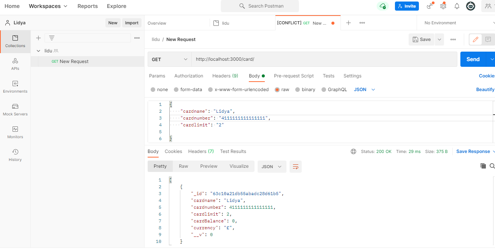
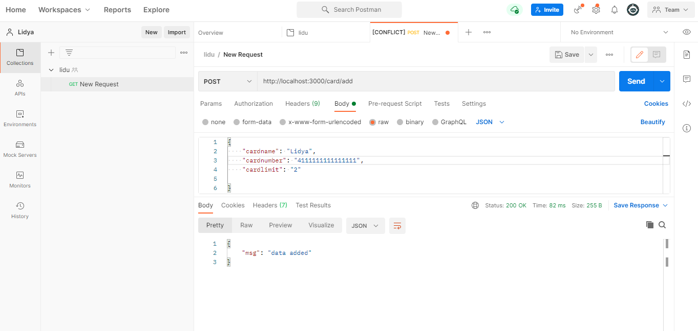
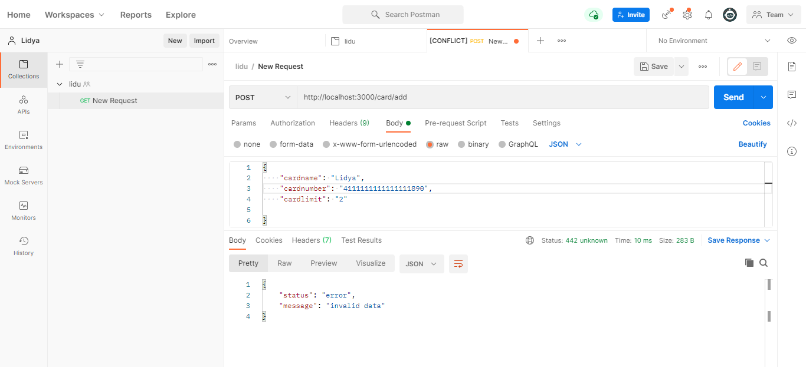

# Credit Card Processing
An application for a credit card provider. It allows you to add new credit card accounts and view them as a list. The backend is a RESTful API.

## Built With

- Nodejs 
- Expressjs
- Mongodb-memory-server

## Getting Started

To get a local copy up and make it run, follow these simple example steps.
-  git clone https://github.com/Lidya1234/creditCardProcessing.git
- npm install
- npm start

## Test
- To get data- GET-http://localhost:3000/card/

- To post data- POST-http://localhost:3000/card/add

### Prerequisites

- code editor
- Browser
- Node.js installed

### Setup

- install code editor
- Browser
- Postman

## Author Details::

👤 **Lidya Ghebreigziabher**

- Github: [@Lidya-github ](https://github.com/Lidya1234)
- Linkedin: [Lidya-linkedin-link](https://www.linkedin.com/in/lidya-ghebreigziabher-4a94391aa/)
 

## 🤝 Contributing

Contributions, issues,and feature requests are welcome!

## Show your support

Give a ⭐️ if you like this project!
